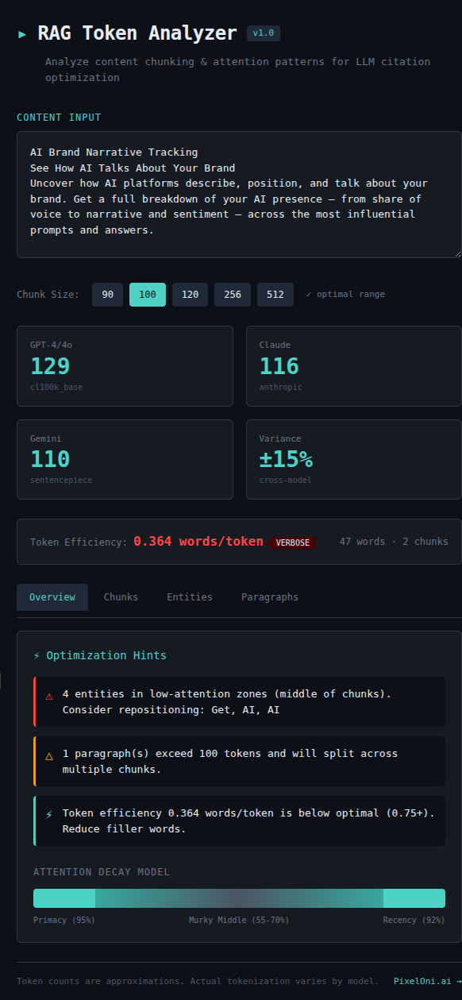

# RAG Token Analyzer

**Analyze content chunking and attention patterns for LLM citation optimization.**

A free tool from [PixelOni.ai](https://pixeloni.ai) that shows where your content will get chunked by RAG systems and how attention degradation affects citation probability.



## Why This Exists

Every token counter shows "your content is 1,247 tokens." This tool shows:

- **Where it breaks** into chunks
- **What that means** for citation probability  
- **How to fix it** with actionable optimization hints

## Features

### Multi-Tokenizer Analysis
- GPT-4/GPT-4o (cl100k_base approximation)
- Claude (Anthropic tokenizer heuristics)
- Gemini (SentencePiece-based)
- Cross-model variance percentage

### Chunk Simulation
- Configurable chunk sizes: 90, 100, 120, 256, 512 tokens
- Visual chunk boundaries with attention heat maps
- Hot zone indicators (chunk 1 and final chunk)

### Attention Decay Model
Based on LLM research showing primacy/recency bias:

```
Position in Chunk    Attention Score
─────────────────    ───────────────
First 15%            95% → 87.5%
Middle 70%           55% → 70% (murky middle)
Last 15%             70% → 92.5%
```

### Entity Position Analysis
- Detects proper nouns, brand names, acronyms
- Maps entity position to attention zones
- Flags entities buried in low-attention regions

### Optimization Hints
Automatic detection of:
- Buried value propositions (key entities after chunk 1)
- Entities in low-attention zones
- Paragraphs that will split across chunks
- Token efficiency below optimal threshold
- Oversized chunk configurations

## Quick Start

```bash
# Clone
git clone https://github.com/mebsites88s/RAG-Token-Analyzer.git
cd rag-token-analyzer

# Install
npm install

# Run dev server
npm run dev

# Build for production
npm run build
```

## Usage

1. Paste your content into the input area
2. Select a chunk size (90-120 tokens recommended for optimal attention)
3. Review the analysis tabs:
   - **Overview**: Optimization hints and attention model
   - **Chunks**: Simulated chunk boundaries with attention heat maps
   - **Entities**: Position analysis for detected entities
   - **Paragraphs**: Token counts per paragraph

## Research Background

This tool implements findings from:

- **Primacy/Recency Bias**: LLMs show higher attention to content at the beginning and end of chunks
- **Murky Middle Problem**: Information in the middle of long contexts receives degraded attention
- **Token Economy**: Higher token efficiency correlates with better retrieval probability

Key references:
- Chroma Research (2025). "Context Rot: How Increasing Input Tokens Impacts LLM Performance"
- Vaswani et al. (2017). "Attention Is All You Need"
- Lewis et al. (2020). "Retrieval-Augmented Generation for Knowledge-Intensive NLP Tasks"

## Optimal Ranges

| Metric | Target | Notes |
|--------|--------|-------|
| Chunk Size | 90-120 tokens | Optimal for attention patterns |
| Token Efficiency | ≥0.75 words/token | Remove filler words |
| Entity Position | Chunk 1, first/last 15% | Primacy/recency advantage |
| Paragraph Length | <chunk size | Avoid mid-paragraph splits |

## Limitations

- **Tokenizers are approximations**: Actual BPE tokenization varies by model version
- **Entity detection is regex-based**: Not true NER, catches capitalized words and acronyms
- **Client-side only**: No actual embedding similarity calculations

## Roadmap (v2)

- [ ] Actual tiktoken integration via WASM
- [ ] Named Entity Recognition with compromise.js
- [ ] Semantic similarity scoring (local embeddings)
- [ ] Export optimization report
- [ ] URL fetch for direct page analysis

## License

MIT

## Author

[PixelOni.ai](https://pixeloni.ai) - Quantitative SEO consulting

---

*"Define it so you can measure it."*
